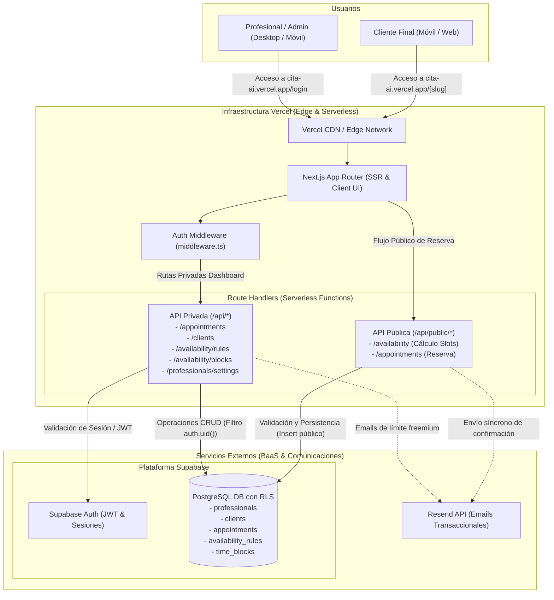

# Diseño del Sistema y Arquitectura: Cita.ai

**Versión:** 1.0 (Línea Base Reconstruida para QA y Arquitectura)  
**Estado:** Vigente  
**Tipo de proyecto:** Brownfield  
**Rol:** Chief Software Architect & Tech Lead  

---

## 1. Stack Tecnológico

| Capa | Tecnología | Justificación y Estado Real |
| :--- | :--- | :--- |
| **Frontend** | Next.js 14+ (App Router), TypeScript, Tailwind CSS, Radix UI, Lucide Icons | Desarrollo ágil de UI reactiva y componentes accesibles. *Nota técnica:* el archivo `tsconfig.json` opera con `strict: false` por deuda técnica inicial (`04-notas-tecnicas.md`). |
| **Formularios y Validación** | React Hook Form + Zod | Validación declarativa de esquemas tanto en cliente como en los endpoints de servidor (`04-notas-tecnicas.md`). |
| **Manejo de Fechas** | Date-fns (locale `es`) | Manipulación y formateo de fechas en español para la grilla semanal y cálculo de slots (`04-notas-tecnicas.md`). |
| **Backend (API)** | Next.js Route Handlers (Serverless Functions) | Arquitectura sin servidor propio. Endpoints modularizados en rutas privadas (`/api/*`) y públicas (`/api/public/*`) ejecutadas en la infraestructura serverless de Vercel (`04-notas-tecnicas.md`). |
| **BaaS / Base de Datos** | Supabase (PostgreSQL 15+) | Provisión de base de datos relacional Postgres administrada, triggers y políticas Row Level Security (RLS) en todas las tablas públicas. Conexión mediante cliente tipado `@supabase/supabase-js` sin ORM (`04-notas-tecnicas.md`). |
| **Autenticación** | Supabase Auth | Flujo de email y contraseña. Manejo de sesiones persistentes mediante tokens JWT en cookies `httpOnly` (vida útil: 15 min; refresh token: 7 días; recuperación con token de 1 hora vía PKCE). Protección en `middleware.ts` (`04-notas-tecnicas.md`). |
| **Emails Transaccionales** | Resend API | Proveedor de correo transaccional para bienvenida, confirmaciones y avisos de reservas. Despacho síncrono en el request de reserva; opera sobre dominio de prueba temporal (`05-hilo-mail-cambio-de-alcance.md`). |
| **Infraestructura y Hosting** | Vercel | Alojamiento serverless con integración de despliegue continuo (CD) directo desde la rama `main`. Dominio en producción: `cita-ai.vercel.app` (`documentacion para QA/nota-ambientes-y-accesos.md`). |

---

## 2. Diagrama de Arquitectura (Mermaid)



---

## 3. Modelo de Datos (Preliminar)

El esquema relacional opera en el esquema `public` de PostgreSQL en Supabase, extendiendo el esquema nativo de autenticación `auth.users`.

```
auth.users (Supabase Auth)
    │ (1:1 vía trigger)
    ▼
professionals ───────────┬──────────────┬──────────────┐
  (id, name, email,      │ (1:N)        │ (1:N)        │ (1:N)
   slug, duracion)       ▼              ▼              ▼
                    appointments  availability_rules time_blocks
                         ▲
                         │ (N:1)
                      clients
               (id, name, email global)
```

### Entidades Clave

*   **`professionals`:** Datos de perfil del profesional.
    *   *Atributos:* `id` (UUID, PK, FK referenciando a `auth.users.id`), `name` (text, not null), `email` (text, not null), `slug` (text, unique, not null), `appointment_duration_minutes` (integer, default 45/60), `created_at` (timestamptz).
*   **`clients`:** Registro de clientes finales que han reservado turnos.
    *   *Atributos:* `id` (UUID, PK), `name` (text, not null), `email` (text, not null, unique global en la tabla), `created_at` (timestamptz).
    *   *Observación arquitectónica:* `email` es único global. Si un mismo cliente reserva con distintos profesionales, comparte el registro; los clientes de un profesional se determinan por join con `appointments` (`04-notas-tecnicas.md`).
*   **`appointments`:** Turnos reservados.
    *   *Atributos:* `id` (UUID, PK), `professional_id` (UUID, FK a `professionals.id`), `client_id` (UUID, FK a `clients.id`), `start_time` (timestamptz, not null), `end_time` (timestamptz, not null), `status` (text, check constraint `status = 'confirmed'`), `created_at` (timestamptz).
*   **`availability_rules`:** Franjas horarias semanales de atención habitual.
    *   *Atributos:* `id` (UUID, PK), `professional_id` (UUID, FK a `professionals.id`), `day_of_week` (integer, 0=Domingo a 6=Sábado), `start_time` (time, not null), `end_time` (time, not null), `created_at` (timestamptz).
*   **`time_blocks`:** Bloqueos puntuales o períodos de indisponibilidad.
    *   *Atributos:* `id` (UUID, PK), `professional_id` (UUID, FK a `professionals.id`), `start_time` (timestamptz, not null), `end_time` (timestamptz, not null), `reason` (text, nullable, sin uso actual en interfaz), `created_at` (timestamptz).

### Políticas de Row Level Security (RLS)

*   `professionals`: `SELECT` público (requerido para renderizar la página de reservas por slug); `INSERT`/`UPDATE` restringido al titular (`auth.uid() = id`).
*   `clients`: `SELECT` exclusivo para usuarios autenticados; `INSERT` público (permite a clientes no registrados crear su ficha al agendar).
*   `appointments`: `SELECT` y `UPDATE` restringido a `auth.uid() = professional_id`; `INSERT` público (cliente reserva de forma anónima).
*   `availability_rules`: `SELECT` público (para calcular slots); `INSERT`/`UPDATE`/`DELETE` restringido a `auth.uid() = professional_id`.
*   `time_blocks`: `SELECT` público (para restar slots); `INSERT`/`UPDATE`/`DELETE` restringido a `auth.uid() = professional_id`.

---

## 4. Diseño de Interfaces (APIs)

*   **Estilo:** REST sobre HTTPS con intercambio de payloads en formato JSON.
*   **Seguridad:** Endpoints privados protegidos por validación de tokens JWT en cookies `httpOnly` mediante Supabase Auth. Endpoints públicos delimitados bajo el prefijo `/api/public/` sin sesión requerida.

### Endpoints Públicos (Flujo de Reserva Anónima)

*   `GET /api/public/availability`
    *   *Descripción:* Calcula y devuelve los turnos libres de un profesional para la semana solicitada.
    *   *Parámetros de consulta:* `professionalId` (UUID) o `slug` (string), `date` (YYYY-MM-DD).
    *   *Lógica:* Consulta `availability_rules`, genera intervalos teóricos según `appointment_duration_minutes`, descuenta citas en `appointments` (`status = 'confirmed'`) y descuenta bloqueos en `time_blocks`.
*   `POST /api/public/appointments`
    *   *Descripción:* Registra una nueva reserva efectuada por el cliente final.
    *   *Payload:* `{ professional_id: string, name: string, email: string, start_time: string, end_time: string }`.
    *   *Lógica:* Busca o inserta en `clients`, verifica límite freemium (10 clientes únicos), verifica disponibilidad inmediata del slot, inserta en `appointments` y dispara correos por Resend.
    *   *Códigos de respuesta:* `201 Created` ante éxito; `403 Forbidden` (`LIMIT_REACHED`) si supera los 10 clientes; `409 Conflict` si el slot fue tomado concurrentemente.

### Endpoints Privados (Panel de Administración del Profesional)

*   `GET /api/appointments` - Retorna el listado de citas confirmadas del profesional en sesión.
*   `GET /api/clients` - Retorna los clientes únicos que tienen o tuvieron turnos con el profesional autenticado.
*   `PUT /api/professionals/settings` - Actualiza preferencias del profesional (ej. `appointment_duration_minutes`, nombre comercial).
*   `POST /api/availability/rules` - Reemplaza atómicamente la configuración recurrente semanal (elimina reglas previas e inserta el nuevo conjunto).
*   `GET /api/availability/blocks` - Lista los bloqueos puntuales vigentes y futuros.
*   `POST /api/availability/blocks` - Crea un nuevo bloqueo horario (`time_blocks`).
*   `DELETE /api/availability/blocks` - Elimina un bloqueo horario existente por ID.

---

## 5. Decisiones de Arquitectura (ADRs)

### ADR 01: Adopción de Monolito Serverless con Next.js y Supabase vs. Microservicios
*   **Contexto:** Proyecto desarrollado ágilmente por un único ingeniero (Diego) con necesidad imperiosa de validar el modelo de negocio con usuarios reales en menos de un mes, sin presupuesto para personal de DevOps (`01-minuta-kickoff.md`, `04-notas-tecnicas.md`).
*   **Decisión:** Implementar una aplicación web monolítica fullstack en Next.js alojada en Vercel, delegando base de datos, autenticación y seguridad por fila (RLS) a Supabase.
*   **Consecuencias:**
    *   *Positivas:* Despliegue automático con cada push a `main`, costos operativos iniciales mínimos ($0 en planes base), tipado de datos compartido entre frontend y backend con TypeScript.
    *   *Negativas:* Fuerte acoplamiento con la plataforma Vercel; limitaciones para tareas en segundo plano o cron jobs en planes gratuitos; ausencia de pipeline formal de integración continua (CI) y staging.

### ADR 02: Cálculo Dinámico de Disponibilidad (Slots) al Vuelo en Memoria
*   **Contexto:** Los profesionales modifican con frecuencia sus horarios y cargan bloqueos imprevistos. Generar y almacenar físicamente miles de slots vacíos en la base de datos requería jobs de sincronización complejos (`04-notas-tecnicas.md`).
*   **Decisión:** No persistir turnos disponibles. El servidor calcula la grilla semanal al vuelo en memoria aplicando las reglas de disponibilidad y restando citas confirmadas y bloqueos activos.
*   **Consecuencias:**
    *   *Positivas:* Cero sobrecarga de almacenamiento en PostgreSQL; reflejo instantáneo de cualquier cambio en reglas o bloqueos.
    *   *Negativas:* El tiempo de cómputo aumenta con el volumen de turnos; vulnerabilidad ante turnos que cruzan la medianoche o diferencias de zonas horarias no normalizadas a UTC (`04-notas-tecnicas.md`, `06-tickets-soporte-resumen.md` #33, #35).

### ADR 03: Validación de Concurrencia en Aplicación vs. Transacción Serializable en Base de Datos
*   **Contexto:** Dos clientes pueden intentar confirmar el mismo horario simultáneamente desde la página pública (`03-especificacion-funcional-v0.3.md`, `04-notas-tecnicas.md`).
*   **Decisión:** Realizar una doble lectura en el handler de la API (al inicio del request y una milésimas antes del insert) en lugar de una función almacenada de Postgres o bloqueo pesimista (`FOR UPDATE`).
*   **Consecuencias:**
    *   *Positivas:* Implementación simple y directa en TypeScript sin lógica en motor SQL.
    *   *Negativas:* Deja una ventana de concurrencia abierta (condición de carrera) que puede derivar en dobles reservas en escenarios de alta concurrencia; constituye una deuda técnica crítica documentada por desarrollo (`04-notas-tecnicas.md`).

### ADR 04: Migración del Servicio de Notificaciones Transaccionales a Resend
*   **Contexto:** El servicio de correo provisto de forma nativa por Supabase provocó problemas severos de entregabilidad (clasificación masiva en spam) y no permitía plantillas HTML ricas para el cliente final (`05-hilo-mail-cambio-de-alcance.md`).
*   **Decisión:** Adoptar la API de Resend para el despacho de correos transaccionales del producto.
*   **Consecuencias:**
    *   *Positivas:* Mayor control del diseño de correos y trazabilidad de entrega.
    *   *Negativas:* Los envíos se realizan de forma síncrona dentro del ciclo de vida del request de reserva (si la API de Resend demora, la experiencia de reserva se ralentiza); se mantiene el riesgo de spam mientras no se configuren registros DNS (SPF/DKIM) para el dominio oficial (`04-notas-tecnicas.md`, `05-hilo-mail-cambio-de-alcance.md`).

---

## 6. Estrategia de Testing (Shift-Left)

En la actualidad, el proyecto presenta una **ausencia total de pruebas automatizadas** (`04-notas-tecnicas.md` indica textualmente: *"tests: no hay ninguno, de ningún tipo"*). Para evitar que los defectos continúen llegando a producción y degradando la confianza de los clientes, se establece la siguiente estrategia de aseguramiento de calidad Shift-Left:

### Niveles de Automatización de Pruebas

*   **Pruebas Unitarias (Jest / Vitest):**
    *   *Cálculo de Disponibilidad:* Probar el algoritmo de generación de slots con `date-fns` ante diferentes duraciones (30, 45, 50, 60 min), cruces de mes, años bisiestos y solapamientos.
    *   *Reglas de Negocio Freemium:* Validar la función `FREE_PLAN_CLIENT_LIMIT` evaluando inserción de clientes 1 a 10 (exitosos) y rechazo del cliente 11 (`LIMIT_REACHED`).
    *   *Validación de Esquemas:* Evaluar esquemas Zod con datos válidos, contraseñas débiles, emails malformados y caracteres especiales.
*   **Pruebas de Integración (API & Base de Datos):**
    *   *Políticas RLS de Supabase:* Verificar que un profesional autenticado no pueda consultar ni modificar citas (`appointments`) o reglas de disponibilidad de otro profesional.
    *   *Control de Inserción Pública:* Comprobar que los endpoints públicos (`/api/public/*`) permitan inserciones anónimas pero rechacen modificaciones no autorizadas.
    *   *Pruebas de Concurrencia Simulada:* Ejecutar requests simultáneos sobre el mismo slot para verificar la robustez del control de superposición y medir la ventana de carrera.
*   **Pruebas End-to-End (Playwright):**
    *   *Flujo Crítico de Reserva (Happy Path):* Acceso anónimo a `https://cita-ai.vercel.app/[slug]`, selección de slot libre, ingreso de datos de cliente y verificación de pantalla de confirmación.
    *   *Flujo de Registro y Onboarding:* Registro de profesional, generación de slug, configuración de agenda y persistencia de horarios.
    *   *Flujo de Límite Freemium:* Simular reserva del cliente 11 y validar la visualización del mensaje explicativo y el banner del Plan Pro en el dashboard.
*   **Integración Continua (CI Pipeline en GitHub Actions):**
    *   Configurar un workflow de GitHub Actions que ejecute chequeo estricto de tipos (`tsc --noEmit`), linter y suite de tests unitarios antes de permitir la fusión a `main`, bloqueando deploys automáticos ante fallas.

---

## Fuentes

| Dato / afirmación técnica | De dónde sale |
| :--- | :--- |
| Stack base (Next.js App Router, TypeScript, Tailwind, Radix UI) | `04-notas-tecnicas.md` · "stack" |
| Configuración de TypeScript con `strict: false` | `04-notas-tecnicas.md` · "stack" |
| Base de datos PostgreSQL y Auth en Supabase sin servidor propio | `04-notas-tecnicas.md` · "stack" |
| Nombres y campos de tablas (`professionals`, `clients`, `appointments`, etc.) | `04-notas-tecnicas.md` · "tablas" |
| Check constraint `status = 'confirmed'` en tabla appointments | `04-notas-tecnicas.md` · "tablas" |
| Políticas de Row Level Security (RLS) en las 5 tablas públicas | `04-notas-tecnicas.md` · "row level security" |
| Tokens JWT (15 min exp, 7 días refresh) en cookies httpOnly y PKCE | `04-notas-tecnicas.md` · "auth" |
| Algoritmo de cálculo de slots al vuelo en memoria | `04-notas-tecnicas.md` · "los slots" |
| Nombres de endpoints públicos (`/api/public/*`) y privados (`/api/*`) | `04-notas-tecnicas.md` · "endpoints" |
| Mecanismo de doble verificación de concurrencia previo al insert | `04-notas-tecnicas.md` · "la reserva" |
| Constante `FREE_PLAN_CLIENT_LIMIT = 10` hardcodeada en `freemium.ts` | `04-notas-tecnicas.md` · "limite del plan gratuito" |
| Migración formal a Resend para emails transaccionales | `05-hilo-mail-cambio-de-alcance.md` · Mail de Diego (28/02/2026) |
| Inexistencia de cron para el recordatorio del día anterior en Vercel | `04-notas-tecnicas.md`; `05-hilo-mail-cambio-de-alcance.md` |
| URL real del sistema en producción (`https://cita-ai.vercel.app/`) | `documentacion para QA/nota-ambientes-y-accesos.md` · "la direccion" |
| Inexistencia de ambiente UAT activo (entorno único de producción) | `documentacion para QA/nota-ambientes-y-accesos.md` · "lo del ambiente de UAT" |
| Ausencia total de tests automatizados en el código | `04-notas-tecnicas.md` · "lo que no esta hecho" |
| Latencias y rendimiento medidos empíricamente (carga < 2s, P95 < 500 ms) | `04-notas-tecnicas.md` · "numeros de rendimiento" |
| Concurrencia estimada en ~100 usuarios simultáneos | `04-notas-tecnicas.md` · "numeros de rendimiento" (estimación del desarrollador) |
| Tiempos y costos de infraestructura para escalar a > 1.000 usuarios | **Hipótesis** — no hay documento que lo respalde |
| Comportamiento ante desconexión o caída total de la API de Resend | **Hipótesis** — no hay documento que lo respalde |

---

## Contradicciones detectadas

*   **Entornos de Despliegue (UAT vs. Producción Única):**  
    *   *Qué dice la documentación técnica preliminar:* `04-notas-tecnicas.md` (sección "ambientes") indica la existencia de dos ambientes separados con bases independientes: `uat.cita.ai` y `cita.ai`.  
    *   *Qué dice la evidencia operativa reciente:* En `documentacion para QA/nota-ambientes-y-accesos.md`, Diego aclara que el ambiente UAT fue abandonado por practicidad y hoy existe una única base de datos y un único despliegue en `https://cita-ai.vercel.app/` donde interactúan usuarios reales y pruebas.  
    *   *Postura adoptada en este diseño:* Se documenta la realidad de un **único entorno de producción**, señalando la necesidad urgente de aislar un entorno de pruebas como recomendación de QA.
*   **Servicio de Correo Transaccional (Supabase vs. Resend):**  
    *   *Qué dice `04-notas-tecnicas.md`:* Señala que los correos salen por el servicio transaccional por defecto integrado en Supabase.  
    *   *Qué dice `05-hilo-mail-cambio-de-alcance.md`:* Registra la decisión posterior y formal de reemplazar Supabase por **Resend** debido a problemas de diseño de plantillas y clasificación en spam.  
    *   *Postura adoptada en este diseño:* Se establece Resend como el proveedor arquitectónico vigente.
*   **Recordatorios automáticos en el stack técnico:**  
    *   *Qué exige el PRD y la especificación funcional:* Envío programado de un correo de recordatorio 24 horas antes del turno.  
    *   *Qué constata la arquitectura implementada:* No existe infraestructura de background jobs ni cron configurada en Vercel, por lo que el recordatorio no forma parte de la arquitectura desplegada en producción.  
    *   *Postura adoptada en este diseño:* Se registra como una **brecha técnica arquitectónica** a resolver mediante la incorporación de Vercel Cron o servicios externos de programación.

---

## Preguntas abiertas

*   **¿Cómo se cerrará la condición de carrera en reservas simultáneas?** ¿Se migrará la lógica de inserción a un Stored Procedure / RPC transaccional en PostgreSQL con aislamiento serializable para garantizar que nunca ocurra una doble reserva? (`04-notas-tecnicas.md` · "la reserva").
*   **¿Qué solución técnica se implementará para programar los recordatorios automáticos (cron)?** ¿Se actualizará el plan de Vercel para utilizar Vercel Cron o se acoplará un servicio externo tipo QStash / GitHub Actions / cron-job.org para invocar un webhook seguro de despacho? (`04-notas-tecnicas.md`; `05-hilo-mail-cambio-de-alcance.md`; `transcripcion-reunion-2026-05-19.md`).
*   **¿Cómo se abordará el modelo de datos para clientes compartidos y multi-profesionales?** Actualmente `clients.email` es único global, lo que impide parametrizar atributos particulares de clientes para cada profesional y complejiza el soporte de consultorios o salones con múltiples profesionales compartiendo cuenta (`04-notas-tecnicas.md` · "tablas"; `06-tickets-soporte-resumen.md` #22).
*   **¿Cuándo se incorporará rate limiting en los endpoints públicos?** La ausencia de límites de peticiones en `/api/public/availability` y `/api/public/appointments` deja a la aplicación vulnerable a abusos de denegación de servicio o scraping (`04-notas-tecnicas.md` · "lo que no esta hecho").
*   **¿Cuál será la estrategia para aislar un ambiente formal de Staging/UAT con seed automatizado?** Dado que hoy las pruebas impactan sobre la base real de producción, ¿cómo se versionarán las migraciones de base de datos para no depender de modificaciones manuales en el panel de Supabase? (`04-notas-tecnicas.md`; `documentacion para QA/nota-ambientes-y-accesos.md`).
